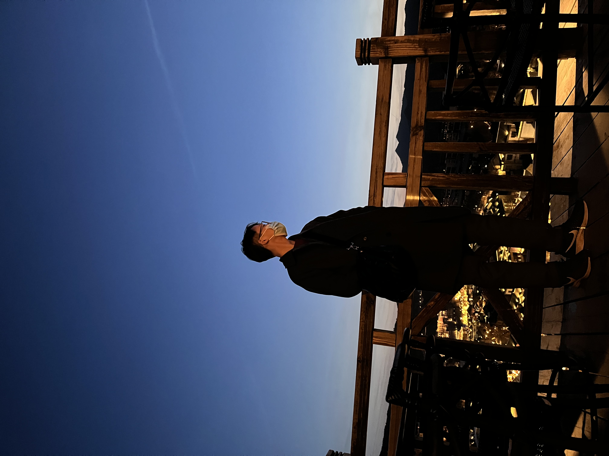

# ITPoorTravel-beijing

## 欢乐谷
### 次数：第一次

#### 开始前
|  | 内容 |
| -------- | ---------- |
| 时间     | 2022-01-01 |
| 原因     | 散心       |
| 人数     | 单刷       |
| 门票消费 | ¥299       |
| 附加消费 | 299是含一个啥啥表演的通票，游玩项目倒是没有需要再继续花钱的，吃的的话大家都懂，景区内便宜不了，大肉串和鱿鱼大概60-70吧，离开时又给本命年的句某买了只小老虎玩偶花了80-90 |

#### 进行时

1. 进门

emmm，平平无奇的门口，去了直接刷一下就OK

2. 蛋糕秋千

不知道是因为冬天的缘故还是我进的比较早(10:30许)，一些比较刺激的项目都没有开，作为进门玩的第一个项目还是能当开胃小菜的，毕竟本身就是来寻刺激的嘛

3. 特洛伊木马

这个说实话就比较一般般，无非就晃晃悠悠玩倒立，想提升刺激感就坐在中间的位置吧

4. 太阳神车

这玩意还挺狠的，查了一下极限加速度到4.3个G，真的很猛，建议必刷，毕竟最高能甩到十五层楼的高度

5. 音乐过山车

中规中矩的过山车项目，至少也有及格分，可以列入必刷项目(冬季)

6. 家庭过山车

人巨多。。。而且作为过山车而言不是那么刺激，看名字也可看出来，如果追求刺激，那这个项目完全不及格，但是带着npy的话也可以试试

7. 雪域神鹰

这是我本次玩的最刺激的项目没有之一，我他妈...这个过山车是让你面朝大地(并非坐姿，而是与轨道平行挂着)，这上上下下是真的吓人，玩的时候我第一次想起一句话：“君子不立于危墙之下”，建议必刷

8. 小脑斧

#### 总结

1. 先说结论，票价是肯定值得，如果不离开北京的话，大概率还要再来
2. 背着包的话，感觉每个项目的临时寄存点都还挺大，放个包不成问题
3. 因为是冬季的原因，一些过山车、跳楼机、漂流项目都是暂时关闭的，这个就稍微可惜，从门口进去能看到的第一个项目--极速飞车，最高速可达150km/h，刺激度拉满，不过本次很遗憾没有玩到
4. 即使是冬天，人也是真的多，如果是约会的话不是很建议到欢乐谷，毕竟排队还挺磨练耐心的
5. 其实还有些小项目，不过懒得都写上，毕竟还玩了小朋友的项目hhh

## 雍和宫

### 次数：第一次
#### 开始前
|          | 内容                     |
| -------- | ------------------------ |
| 时间     | 2022-1-1                 |
| 原因     | 给老妈祈福               |
| 人数     | 1                        |
| 门票消费 | ¥25                      |
| 附加消费 | 求了一串香灰瓷手串，¥290 |

#### 进行时

1. 进门

差不多踩着开门时间去的，但是人也很多，主要原因也是阳历的1-1，大家都盼个好彩头

2. 领香

左右两边都可以免费领香，进寺后记得最基本几点

* 从左向右转
* 门槛迈过不踩
* 左近先过左脚，反之亦然
* 不拜佛就不进殿
* 还有就是为了消防安全，不要带着燃着的香进殿礼佛

3. get

4. 看看香火

#### 总结
1. 早点来其实也没啥用，运气好的话八点半左右就能开门，运气不好还是要乖乖排队
2. 不要在外边求，沿着左侧向内走很快就能看到一个小法物流通处，在这里是不需要排队进入的
3. 在这个法物流通处出门后再向前五十步就是开光室，免费的哈

### 次数：第二次

#### 开始前

|          | 内容                       |
| -------- | -------------------------- |
| 时间     | 2022-1-2                   |
| 原因     | 陪朋友祈福                 |
| 人数     | 2                          |
| 门票消费 | ¥25                        |
| 附加消费 | 求了一枚六字真言戒指，¥270 |

#### 进行时

1. 巨长的队

2. 天气很好，随便拍了一张

3. 戒指

#### 总结

1. 主要是陪大哥，没啥结论倒是

### 次数：第三次

#### 开始前

|          | 内容       |
| -------- | ---------- |
| 时间     | 2022-1-9   |
| 原因     | 陪朋友祈福 |
| 人数     | 6          |
| 门票消费 | ¥25        |
| 附加消费 | /          |

#### 进行时

1. 来太多次了，摆了。。

#### 总结

1. 不要忘记带身份证！

## 八达岭长城

### 次数：第一次

#### 开始前

|          | 内容                                           |
| -------- | ---------------------------------------------- |
| 时间     | 2022-1-20                                      |
| 原因     | 散心                                           |
| 人数     | 2                                              |
| 门票消费 | ¥35                                            |
| 附加消费 | 高铁票30吧，然后因为大雪不是很敢下去，缆车¥150 |

#### 进行时

1. 出站

2. 爬长城

3. 猫猫

#### 总结

1. 下雪时一定要戴手套，不然百分之一千的会后悔
2. 有感而发

忽见梨花漫天飞，原是晴雪寒风随。
长龙伏山气势巍，雾里登顶才得窥。

## 古北水镇

### 次数：第一次

#### 开始前

|          | 内容                                                         |
| -------- | ------------------------------------------------------------ |
| 时间     | 2022-2-27                                                    |
| 原因     | 自驾游                                                       |
| 人数     | 9                                                            |
| 门票消费 | ¥140                                                         |
| 附加消费 | 租了两辆车，最后车费每人应该在160左右，出发前买了些零食、饮料和水，在景区喝了杯咖啡¥58 |

#### 进行时

1. 出发

说是出发 其实这时候都快到了，毕竟司机没时间拍照

2. 虽然不知道是啥但是看起来很好看的楼

3. 从桥洞依稀可见的小伙伴以及桥下的小兔子

4. 看起来像是冬日流行的飞机云与阳光下的雪景

5. 太阳西沉

6. 拉高点亮度 嘿嘿

7. 开灯啦

8. 门里门外

9. 我

#### 总结

## 吃&喝

### 南锣鼓巷

#### 简评

有一说一 地方配不上这个名气啊，细看下来其实没啥想吃的

随便和大哥搞了点，没啥放图的必要了

### 聚宝源

#### 特点

铜锅涮肉

#### 地点

后海，出了地铁站向北直走再向东很快就能看到

#### 简评

和zw大哥来的，貌似是连锁的老店，地界儿好，去什刹海玩可以来这里试一下，地方还蛮大的，而且巨便宜hhh

### 糖房咖啡

#### 特点

有露天也有室内，不嘈杂

#### 地点

庆云楼楼上

#### 简评

还不错，挺巴适的

### 一乐拉面

#### 特点
特点就是一乐拉面

#### 地点
王府井站F口出去直走，在百货大楼6F

#### 简评
真不戳，就是有点羞耻

写作兵粮丸的章鱼烧，还有恰不完的叉烧

### 高满堂

### 喜炉匠

### 蚝英雄

### 东来顺

### 高兴壹锅

### 老诚一锅

